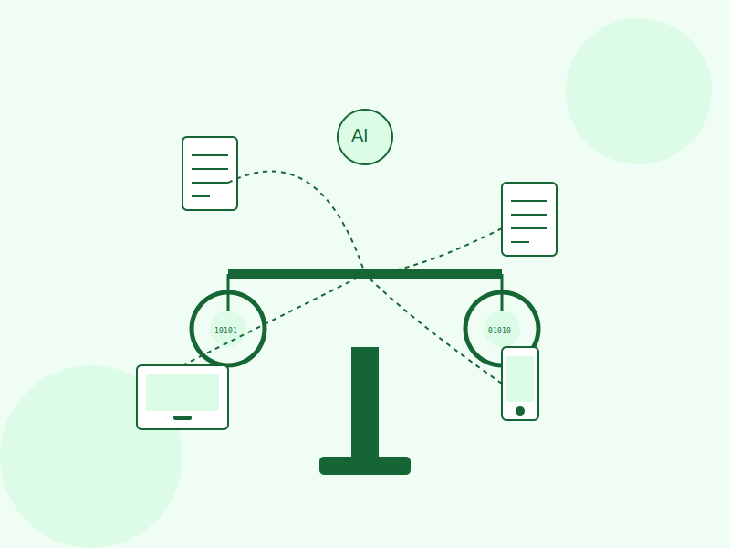

# CasePilot - Modern Legal Tech Platform

CasePilot is a modern solution to delays in the justice system, providing a user-friendly LegalTech platform that helps users track cases, get AI assistance, and resolve disputes online. Built for WeHack hackathon by Team Amigos.



## 🌟 Demo

🔗 **Live Demo**: [(https://teamamigos-wehack.vercel.app/)]  
📱 **Repository**: [https://github.com/Jasharaj/WeHack-TeamAmigos-Frontend](https://github.com/Jasharaj/WeHack-TeamAmigos-Frontend)

## 🚀 Features

- **🤖 AI-Powered Legal Assistant** - Get instant answers to legal queries and document analysis with Google's Gemini AI
- **📋 Case Tracking & Management** - Create, track, and manage legal cases with real-time status updates
- **📄 Document Management** - Securely store, organize, and share legal documents in one centralized location
- **⚖️ Online Dispute Resolution** - Resolve disputes efficiently through our online mediation platform
- **⏰ Smart Reminders** - Never miss a hearing or deadline with automated notifications and calendar integration
- **👨‍💼 Dual Dashboard System** - Separate interfaces for lawyers and clients with role-based access
- **📱 Responsive Design** - Access your legal matters on any device - web, tablet, or mobile
- **🔒 Secure Authentication** - JWT-based authentication with role-based access control

## 🛠️ Tech Stack

- **Framework**: Next.js 15.2.3 with App Router
- **Language**: TypeScript 5
- **Frontend**: React 19 with modern hooks
- **Styling**: TailwindCSS 3.4 with custom animations
- **UI Components**: 
  - Radix UI primitives for accessibility
  - Lucide React icons
  - Heroicons
  - Framer Motion for animations
- **AI Integration**: Google Generative AI (Gemini)
- **Data Tables**: TanStack React Table
- **Calendar**: React Big Calendar
- **State Management**: React Hooks with Context API
- **Authentication**: JWT with localStorage
- **Date Handling**: date-fns and Moment.js

## 🏗️ Project Structure

```
WeHack-TeamAmigos-Frontend/
├── public/                    # Static assets and SVG icons
│   ├── legal-hero.svg        # Hero section illustration
│   └── ...                   # Other icons and assets
├── src/
│   ├── app/                  # Next.js App Router
│   │   ├── lawyer-dashboard/ # Lawyer interface
│   │   │   ├── assistant/    # AI assistant for lawyers
│   │   │   ├── cases/        # Case management
│   │   │   ├── disputes/     # Dispute resolution
│   │   │   ├── documents/    # Document management
│   │   │   ├── profile/      # Lawyer profile
│   │   │   ├── reminders/    # Calendar & reminders
│   │   │   └── reports/      # Analytics & reports
│   │   ├── user-dashboard/   # Client interface
│   │   │   ├── assistant/    # AI assistant for users
│   │   │   ├── cases/        # Case tracking
│   │   │   ├── disputes/     # Dispute initiation
│   │   │   ├── documents/    # Document storage
│   │   │   ├── profile/      # User profile
│   │   │   ├── reminders/    # Calendar & notifications
│   │   │   └── reports/      # Case reports
│   │   ├── login/           # Authentication
│   │   ├── register/        # User registration
│   │   ├── globals.css      # Global styles
│   │   ├── layout.tsx       # Root layout
│   │   └── page.tsx         # Landing page
│   ├── components/          # Reusable UI components
│   │   ├── dashboard/       # Dashboard-specific components
│   │   ├── user-dashboard/  # User dashboard components
│   │   ├── HeroSection.tsx  # Landing page sections
│   │   ├── Navbar.tsx       # Navigation component
│   │   └── ...              # Other UI components
│   ├── lib/                 # Utility libraries
│   │   └── utils.ts         # Helper functions
│   ├── utils/               # Application utilities
│   │   ├── chatStorage.ts   # Chat persistence
│   │   ├── dashboardStorage.ts # Dashboard state
│   │   └── gemini.ts        # AI integration
│   └── config.js            # App configuration
├── components.json          # Shadcn/ui config
├── next.config.js          # Next.js configuration
├── tailwind.config.js      # TailwindCSS configuration
├── tsconfig.json           # TypeScript configuration
└── package.json            # Dependencies and scripts
```

## 🚦 Getting Started

### Prerequisites

- **Node.js** 18.x or higher
- **npm** or **yarn** package manager
- **Git** for version control

### Installation

1. **Clone the repository:**
   ```bash
   git clone https://github.com/Jasharaj/WeHack-TeamAmigos-Frontend.git
   cd WeHack-TeamAmigos-Frontend
   ```

2. **Install dependencies:**
   ```bash
   npm install
   # or
   yarn install
   ```

3. **Configure environment variables:**
   - Create a `.env.local` file in the root directory
   - Add your Google Gemini API key:
     ```env
     GOOGLE_API_KEY=your_gemini_api_key_here
     ```
   - Update `src/config.js` with your backend API URL if needed

4. **Start the development server:**
   ```bash
   npm run dev
   # or
   yarn dev
   ```

5. **Open your browser:**
   Navigate to [http://localhost:3000](http://localhost:3000) to see the application

## 🔄 Available Scripts

- **`npm run dev`** - Start the development server with hot reload
- **`npm run build`** - Build the application for production
- **`npm start`** - Start the production server
- **`npm run lint`** - Run ESLint to check code quality and fix issues

## 🌐 Deployment

The application can be deployed to various platforms:

### Vercel (Recommended)
```bash
# Install Vercel CLI
npm i -g vercel

# Deploy
vercel --prod
```

### Other Platforms
- **Netlify** - Connect your GitHub repo for auto-deploy
- **AWS Amplify** - Full-stack deployment with backend integration
- **Docker** - Containerized deployment

### Environment Variables for Production
Make sure to set the following environment variables in your deployment platform:
- `GOOGLE_API_KEY` - Your Google Gemini API key
- `NEXTAUTH_SECRET` - Secret for authentication (if using NextAuth)
- `NEXT_PUBLIC_API_URL` - Your backend API URL

## 👥 User Roles & Features

### 🧑‍💼 For Citizens/Users
- **📝 Case Management** - Create, track, and manage legal cases
- **🤖 AI Legal Assistant** - Get instant answers to legal queries
- **📁 Document Storage** - Securely upload and organize legal documents
- **⚖️ Dispute Resolution** - Initiate online dispute resolution processes
- **📅 Smart Reminders** - Set and receive notifications for important dates
- **📊 Case Reports** - Generate and view detailed case reports
- **💬 Communication** - Direct communication with assigned lawyers

### 👨‍⚖️ For Lawyers
- **📋 Case Dashboard** - Comprehensive view of all assigned cases
- **👥 Client Management** - Manage client relationships and communications
- **📄 Document Access** - Access and manage client documents securely
- **💼 Legal Advice Platform** - Provide professional legal guidance
- **📈 Analytics & Reports** - Track case progress and generate reports
- **🔔 Notification System** - Stay updated with case developments
- **⚖️ Dispute Mediation** - Facilitate online dispute resolution

## 🔒 Authentication & Security

- **JWT Authentication** - Secure token-based authentication system
- **Role-Based Access Control** - Different permissions for users and lawyers
- **LocalStorage Management** - Secure token storage with automatic cleanup
- **Route Protection** - Protected routes based on authentication status
- **Session Management** - Automatic token refresh and logout handling

## 🤖 AI Integration

CasePilot integrates with **Google's Gemini AI** to provide:
- **Legal Query Processing** - Natural language understanding for legal questions
- **Document Analysis** - AI-powered document review and summarization
- **Case Insights** - Intelligent case analysis and recommendations
- **Automated Responses** - Quick responses to common legal queries

## 🎨 UI/UX Features

- **Modern Design System** - Built with TailwindCSS and Radix UI
- **Responsive Layout** - Mobile-first design that works on all devices
- **Smooth Animations** - Framer Motion powered transitions and interactions
- **Dark/Light Mode** - Theme switching capability (if implemented)
- **Accessibility** - WCAG compliant with proper ARIA labels
- **Loading States** - Skeleton loaders and progress indicators

## 🤝 Contributing

We welcome contributions from the community! Here's how you can help:

### Getting Started
1. Fork the repository
2. Create a feature branch: `git checkout -b feature/amazing-feature`
3. Make your changes and commit them: `git commit -m 'Add amazing feature'`
4. Push to the branch: `git push origin feature/amazing-feature`
5. Open a Pull Request

### Development Guidelines
- Follow TypeScript best practices
- Write meaningful commit messages
- Add comments for complex logic
- Ensure responsive design
- Test your changes thoroughly

### Bug Reports
If you find a bug, please create an issue with:
- Clear description of the problem
- Steps to reproduce
- Expected vs actual behavior
- Screenshots if applicable

## 📋 Roadmap

- [ ] Mobile app development (React Native)
- [ ] Advanced AI features with legal document templates
- [ ] Integration with court systems APIs
- [ ] Multi-language support
- [ ] Advanced analytics dashboard
- [ ] Video conferencing for consultations
- [ ] Payment gateway integration
- [ ] Blockchain-based document verification

## 👨‍💻 Team Amigos

Built with ❤️ for WeHack hackathon by **Team Amigos**

## 📝 License

This project is licensed under the MIT License - see the [LICENSE](LICENSE) file for details.

## 📞 Contact & Support

For questions, feedback, or support:

- **GitHub Issues**: [Create an issue](https://github.com/Jasharaj/WeHack-TeamAmigos-Frontend/issues)
- **Email**: [Contact Team Amigos](mailto:team.amigos.wehack@example.com)
- **Repository**: [https://github.com/Jasharaj/WeHack-TeamAmigos-Frontend](https://github.com/Jasharaj/WeHack-TeamAmigos-Frontend)

---

**⭐ If you find CasePilot helpful, please give us a star on GitHub!**